  

I build autonomous agents and the payment rails they run on, mostly at hackathons, mostly shipped to mainnet before the deadline. Home is the **TON** community; the work spans Starknet, Solana, Sui and Stellar. Everything ships under **16labs**, the studio I'm building into a company.

### Building

| Project | What it is | Built with |
|---|---|---|
| **[agentr](https://github.com/daraijaola/agentr)** | AI agent factory for TON and Telegram: agents that hold wallets, call real tools and live inside chat. | TypeScript · TON · Telegram |
| **Clovoc** | An AI who sits in the room with you. Room-first: chat and build in the same place, the room keeps the history. Not your assistant, your cofounder. In development. | Next.js · TypeScript |

More in the [repositories](https://github.com/daraijaola?tab=repositories): sealed trading track records on Sui, pay-per-use code execution for agents on Stellar, a Solana reaction game on ephemeral rollups, a cross-chain invoice bot on STON.fi, an AI-native compression language.

### Stack

`TypeScript` `Next.js` `Node` `Python` `Solidity` `Move` · Telegram bots, MCP servers, OpenRouter-style gateways · Docker, SQLite/libsql, GitHub Actions

### Reach me

[Michealijaola@outlook.com](mailto:Michealijaola@outlook.com) · [@Micheal_node](https://x.com/Micheal_node) · [16labs.xyz](https://16labs.xyz)

Open to teaming up on hackathons and to early conversations about 16labs.
